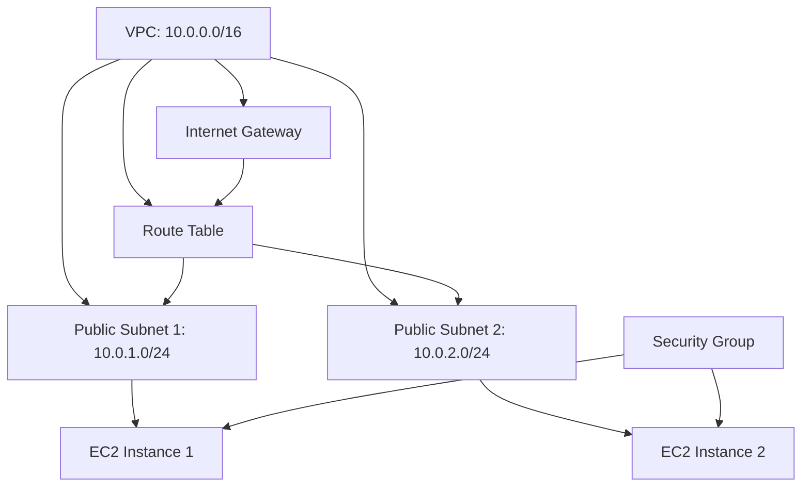

# AWS Infrastructure as Code with Terraform

A comprehensive Terraform configuration for provisioning and managing AWS cloud infrastructure resources.

## Tech Stack

- Terraform (Infrastructure as Code)
- AWS (Amazon Web Services)
- AWS EC2, VPC, Security Groups, S3

## Prerequisites

- Terraform 1.0+ installed
- AWS CLI configured with appropriate credentials
- AWS Account with necessary permissions for EC2, VPC, S3, and IAM resources
- SSH key pair for EC2 instance access

## Installation and Setup

1. Clone the repository:
   ```bash
   git clone <repository-url>
   cd <repository-directory>
   ```

2. Initialize Terraform:
   ```bash
   terraform init
   ```

3. Review the planned infrastructure changes:
   ```bash
   terraform plan
   ```

4. Apply the infrastructure configuration:
   ```bash
   terraform apply
   ```

5. Confirm the changes by typing `yes` when prompted.

## Project Structure

The infrastructure is organized into modular Terraform files:

- **provider.tf** - Configures the AWS provider and authentication settings
- **backend.tf** - Manages Terraform state storage (typically in S3 with DynamoDB locking)
- **network.tf** - Defines VPC, subnets, internet gateways, route tables, and networking components
- **security_groups.tf** - Configures security group rules for inbound and outbound traffic control
- **ec2_instances.tf** - Provisions EC2 compute instances with appropriate configurations
- **s3.tf** - Creates S3 buckets for object storage with versioning and access policies

## Architecture Overview

This Terraform configuration creates a complete AWS infrastructure with:

- **Networking Layer** (network.tf): VPC infrastructure with public/private subnets, internet gateway, and route tables for traffic routing
- **Security Layer** (security_groups.tf): Network access control policies defining ingress and egress rules
- **Compute Layer** (ec2_instances.tf): EC2 instances for running applications and services
- **Storage Layer** (s3.tf): S3 buckets for data persistence and backup storage
- **State Management** (backend.tf): Remote state storage configuration for team collaboration
- **Provider Configuration** (provider.tf): AWS account and region settings

## Usage

Deploy the infrastructure using standard Terraform commands:

```bash
terraform init
terraform plan
terraform apply
```

### Deploy Infrastructure

```bash
terraform apply
```

### View Current Infrastructure

```bash
terraform show
```

### Destroy Infrastructure

```bash
terraform destroy
```

### Validate Configuration

```bash
terraform validate
```

## Configuration Variables

Edit `.tfvars` files or use `-var` flags to customize:
- AWS region
- Instance types and counts
- VPC CIDR blocks
- Subnet configurations
- Security group rules
- S3 bucket names and policies

## State Management

The backend.tf file configures remote state storage, ensuring state is safely stored and shared across team members. Ensure proper access controls and versioning are enabled.

## Best Practices

- Always run `terraform plan` before applying changes
- Keep sensitive information in `.tfvars` files (not in version control)
- Use descriptive naming conventions for resources
- Enable versioning and encryption for S3 backend
- Regularly audit security group rules
- Test infrastructure changes in non-production environments first

# Terraform Infrastructure - Security Hardening

## Overview

The infrastructure includes:
- A custom VPC with CIDR block 10.0.0.0/16
- Two public subnets for distributing resources across availability zones
- Two t2.micro EC2 instances running Ubuntu
- Internet Gateway for external connectivity
- Security group with HTTP and SSH access rules
- Route table for public subnet routing

## Security Improvements

### Network Security

- **Restricted SSH Access**: SSH (port 22) access is restricted to specific IP addresses (10.0.0.1/32) instead of allowing public access (0.0.0.0/0)
- **Public IP Assignment**: Automatic public IP assignment on subnets is disabled (map_public_ip_on_launch = false) to enforce explicit IP allocation policies
- **VPC Flow Logs**: Enabled VPC Flow Logs to monitor and log all network traffic for audit and troubleshooting purposes

### Compute Security

- **IAM Instance Profiles**: EC2 instances are configured with IAM instance profiles to enable role-based access control and eliminate the need for hardcoded credentials

### Storage Security

- **S3 Public Access Block**: S3 buckets are protected with public access blocks that prevent accidental public exposure of sensitive data
- **Server-Side Encryption**: S3 buckets use AWS KMS encryption for server-side encryption, ensuring data is encrypted at rest
- **S3 Bucket Notifications**: SNS topic integration enables real-time notifications for S3 object creation events

## Infrastructure Components

### Core Resources

- **EC2 Instances** (`ec2_instances.tf`): Two EC2 instances with IAM instance profiles
- **Networking** (`network.tf`): VPC with public subnets, route tables, and VPC Flow Logs
- **Storage** (`s3.tf`): S3 bucket with encryption, public access controls, and event notifications
- **Security Groups** (`security_groups.tf`): Restrictive ingress rules for EC2 instances

## Compliance

This infrastructure has been reviewed and hardened against Checkov security checks. All resources follow AWS security best practices for encryption, access control, and network isolation.

# Terraform AWS Infrastructure

This Terraform project provisions a basic AWS infrastructure with VPC, subnets, EC2 instances, and networking components.

## Architecture



## Files

### vpc.tf

Defines the custom VPC and public subnets for the infrastructure.

### ec2_instances.tf

Provisioned two t2.micro EC2 instances with Ubuntu AMI, basic system updates, and security group associations for SSH and HTTP access.

### network.tf

Contains Internet Gateway, route table, and route table associations to enable public routing for both subnets.

### security_groups.tf

Defines security group rules:
- **SSH (Port 22):** Allows inbound traffic from anywhere (0.0.0.0/0) for remote access
- **HTTP (Port 80):** Allows inbound traffic from the internal subnets (10.0.1.0/24 and 10.0.2.0/24)
- **All Egress:** Allows all outbound traffic

## Deployment

1. Initialize Terraform:
   ```bash
   terraform init
   ```

2. Review the planned infrastructure:
   ```bash
   terraform plan
   ```

3. Apply the configuration:
   ```bash
   terraform apply
   ```

## Security Considerations

- SSH access is open to the entire internet (0.0.0.0/0). For production use, restrict this to specific IP ranges.
- Ensure EC2 key pairs are properly secured and managed.
- Monitor security group rules regularly for unnecessary open access.
