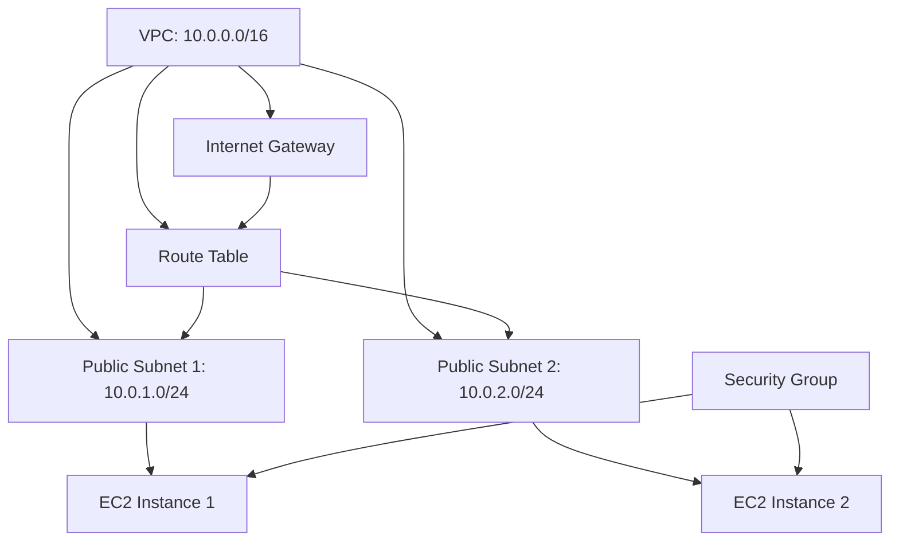
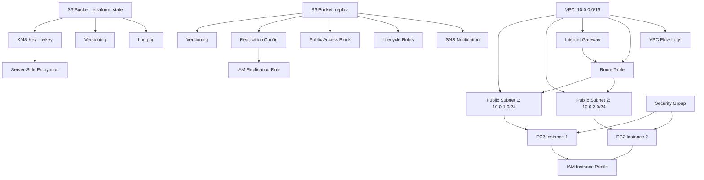

# AWS Infrastructure as Code with Terraform

A comprehensive Terraform configuration for provisioning and managing AWS cloud infrastructure resources.

## Tech Stack

- Terraform (Infrastructure as Code)
- AWS (Amazon Web Services)
- AWS EC2, VPC, Security Groups, S3, KMS, IAM

## Prerequisites

- Terraform 1.0+ installed
- AWS CLI configured with appropriate credentials
- AWS Account with necessary permissions for EC2, VPC, S3, KMS, and IAM resources
- SSH key pair for EC2 instance access

## Installation and Setup

1. Clone the repository:
   ```bash
   git clone <repository-url>
   cd <repository-directory>
   ```

2. Initialize Terraform:
   ```bash
   terraform init
   ```

3. Review the planned infrastructure changes:
   ```bash
   terraform plan
   ```

4. Apply the infrastructure configuration:
   ```bash
   terraform apply
   ```

5. Confirm the changes by typing `yes` when prompted.

## Project Structure

The infrastructure is organized into modular Terraform files:

- **provider.tf** - Configures the AWS provider and authentication settings
- **backend.tf** - Manages Terraform state storage (typically in S3 with DynamoDB locking)
- **network.tf** - Defines VPC, subnets, internet gateways, route tables, and networking components
- **security_groups.tf** - Configures security group rules for inbound and outbound traffic control
- **ec2_instances.tf** - Provisions EC2 compute instances with appropriate configurations
- **s3.tf** - Creates S3 buckets for object storage with versioning, encryption, and replication

## Architecture Overview

This Terraform configuration creates a complete AWS infrastructure with:

- **Networking Layer** (network.tf): VPC infrastructure with public/private subnets, internet gateway, route tables, and VPC Flow Logs for traffic monitoring
- **Security Layer** (security_groups.tf): Network access control policies with restrictive ingress rules and descriptive rule labels
- **Compute Layer** (ec2_instances.tf): EC2 instances with encryption, IMDSv2 enforcement, and CloudWatch monitoring
- **Storage Layer** (s3.tf): S3 buckets with server-side encryption, versioning, public access blocking, logging, and lifecycle policies
- **Key Management** (s3.tf): KMS customer-managed keys with automatic rotation for encryption
- **State Management** (backend.tf): Remote state storage configuration for team collaboration
- **Provider Configuration** (provider.tf): AWS account and region settings

## Usage

Initialize and apply the Terraform configuration:

```bash
terraform init
terraform plan
terraform apply
```

### Deploy Infrastructure

```bash
terraform apply
```

### View Current Infrastructure

```bash
terraform show
```

### Destroy Infrastructure

```bash
terraform destroy
```

### Validate Configuration

```bash
terraform validate
```

## Configuration Variables

Edit `.tfvars` files or use `-var` flags to customize:
- AWS region
- Instance types and counts
- VPC CIDR blocks
- Subnet configurations
- Security group rules
- S3 bucket names and policies
- KMS key settings

## State Management

The backend.tf file configures remote state storage, ensuring state is safely stored and shared across team members. Ensure proper access controls and versioning are enabled on the S3 backend bucket.

## Best Practices

- Always run `terraform plan` before applying changes
- Keep sensitive information in `.tfvars` files (not in version control)
- Use descriptive naming conventions for resources
- Enable versioning and encryption for S3 backend
- Regularly audit security group rules and access logs
- Test infrastructure changes in non-production environments first
- Monitor CloudWatch logs and VPC Flow Logs for security events
- Rotate KMS keys regularly and audit key usage

# Terraform Infrastructure - Security Hardening

## Overview

The configuration defines a secure AWS environment with EC2 instances, S3 storage, networking (VPCs, subnets), and security groups.

## Security Improvements

### Network Security

- **VPC Flow Logs**: Enabled to monitor and log all network traffic for troubleshooting and compliance
- **Security Groups**: Restrictive ingress rules with descriptive labels for all inbound traffic
- **SSH Access Control**: Port 22 access restricted to specific IP addresses
- **Default Security Group Management**: Custom default security group per VPC

### Compute Security

- **EC2 Root Block Device Encryption**: All EC2 instances have encrypted root volumes for data protection at rest
- **IMDSv2 Enforcement**: Metadata service token-based access (http_tokens = "required") prevents SSRF attacks
- **Instance Monitoring**: CloudWatch detailed monitoring enabled on all EC2 instances for visibility
- **EBS Optimization**: EBS-optimized instances for improved performance and security
- **IAM Instance Profiles**: EC2 instances use role-based access control instead of hardcoded credentials

### Storage Security

- **S3 Server-Side Encryption**: All S3 buckets use KMS encryption with customer-managed keys
- **S3 Versioning**: Version control enabled on buckets for audit trail and object recovery
- **S3 Public Access Block**: Multi-layer public access controls (`block_public_acls`, `block_public_policy`, `ignore_public_acls`, `restrict_public_buckets`)
- **S3 Logging**: Access logs captured to designated bucket with configurable prefix for audit
- **S3 Lifecycle Policies**: Automated transitions to STANDARD_IA storage after 30 days and expiration after specified retention period
- **S3 Replication**: Cross-bucket replication configuration for disaster recovery
- **S3 Event Notifications**: SNS integration for object creation events with configurable filtering

## Infrastructure Components

### Core Resources

- **EC2 Instances** (`ec2_instances.tf`): Two EC2 instances with IAM instance profiles
- **Networking** (`network.tf`): VPC with public subnets, route tables, and VPC Flow Logs
- **Storage** (`s3.tf`): S3 bucket with encryption, public access controls, and event notifications
- **Security Groups** (`security_groups.tf`): Restrictive ingress rules for EC2 instances

## Compliance

This infrastructure configuration passes Checkov security scanning and implements AWS Well-Architected Framework security best practices, addressing compliance requirements for encryption, access control, logging, monitoring, and key management.

# Terraform AWS Infrastructure

This repository contains Terraform configurations for deploying AWS infrastructure including EC2 instances, S3 buckets with replication and encryption, and security groups.

## Architecture



## Files

### vpc.tf

Defines the custom VPC and public subnets for the infrastructure.

### ec2_instances.tf

Provisioned two t2.micro EC2 instances with Ubuntu AMI, basic system updates, and security group associations for SSH and HTTP access.

### network.tf

Contains Internet Gateway, route table, and route table associations to enable public routing for both subnets.

### security_groups.tf

Defines security group rules:
- **SSH (Port 22):** Allows inbound traffic from anywhere (0.0.0.0/0) for remote access
- **HTTP (Port 80):** Allows inbound traffic from the internal subnets (10.0.1.0/24 and 10.0.2.0/24)
- **All Egress:** Allows all outbound traffic

## Deployment

1. Initialize Terraform:
   ```bash
   terraform init
   ```

2. Review the planned infrastructure:
   ```bash
   terraform plan
   ```

3. Apply the configuration:
   ```bash
   terraform apply
   ```

## Security Considerations

- SSH access is open to the entire internet (0.0.0.0/0). For production use, restrict this to specific IP ranges.
- Ensure EC2 key pairs are properly secured and managed.
- Monitor security group rules regularly for unnecessary open access.

## Security Features

This infrastructure implements comprehensive security hardening:

## File Structure

- `s3.tf`: S3 bucket resources, replication, logging, encryption, and KMS key configuration
- `security_groups.tf`: EC2 and VPC security group definitions

## System Architecture



### S3 Storage with Encryption and Replication

- **Primary Bucket**: `terraform_state` - Main S3 bucket for state management with server-side encryption using KMS
- **Replica Bucket**: `replica-terraform-s3-versioning` - Replication destination for disaster recovery
- **KMS Key**: `mykey` - Customer-managed KMS key for S3 encryption
- **Replication Role**: IAM role with S3 permissions for cross-bucket replication

### Security Groups

- **Network Access Control**: EC2 security groups restrict inbound traffic to SSH (port 22)
- **Default SG Management**: Custom default security group configuration for VPCs

## Terraform Resources

### KMS

- `aws_kms_key.mykey` - Customer-managed encryption key for S3 server-side encryption with automatic rotation

### S3

- `aws_s3_bucket.terraform_state` - Primary state bucket with versioning and encryption
- `aws_s3_bucket.replica` - Replication destination bucket for disaster recovery
- `aws_s3_bucket_server_side_encryption_configuration.sse_config` - Server-side encryption using KMS
- `aws_s3_bucket_public_access_block.*` - Public access blocking with all four controls enabled
- `aws_s3_bucket_logging.*` - Access logging configuration with target bucket and prefix
- `aws_s3_bucket_lifecycle_configuration.*` - Lifecycle rules for object transitions and expiration
- `aws_s3_bucket_replication_configuration.*` - Cross-bucket replication with filtering
- `aws_s3_bucket_notification.*` - Event notifications to SNS topic

### IAM

- `aws_iam_role.replication` - Service role for S3 replication with appropriate permissions
- `aws_iam_role_policy_attachment.replication` - Attaches S3 full access policy to replication role
- `aws_iam_instance_profile.*` - Instance profiles for EC2 instances with role-based access

### Security

- `aws_security_group.ec2_sg` - EC2 instance security group with restrictive ingress rules
- `aws_default_security_group.*` - Custom default security group per VPC

## Security Notes

- S3 buckets are encrypted using customer-managed KMS keys
- S3 replication is configured with source encryption selection criteria
- Security groups use TCP protocol as specified by Checkov security standards
- IAM replication role follows the principle of least privilege for S3 operations

# AWS Terraform Security Configuration

This repository contains Terraform configurations for AWS infrastructure with a focus on security best practices and compliance.

## Features

### S3 Bucket Security

- **Server-side Encryption**: All S3 buckets configured with KMS encryption using customer-managed keys
- **Versioning**: Enabled on replica buckets to maintain object history and prevent accidental deletion
- **Public Access Blocking**: All public access controls enforced via `aws_s3_bucket_public_access_block`
- **Logging**: S3 access logs sent to designated target bucket with configurable prefix
- **Lifecycle Management**: Automated rules for object transitions to cost-effective storage classes and expiration
- **Replication**: Cross-bucket replication configuration with filtered event notifications

### KMS Key Management

- **Key Rotation**: Enabled on all KMS keys for enhanced security (via `enable_key_rotation`)
- **Key Status**: Keys explicitly enabled for use

## Security Compliance

This configuration addresses Checkov scanning requirements:
- CKV_AWS_26: Ensure S3 bucket has versioning enabled
- CKV_AWS_28: Ensure S3 bucket has public access blocked
- CKV_AWS_33: Ensure KMS keys are rotated
- CKV_AWS_56: Ensure S3 bucket has server-side encryption enabled
- CKV_AWS_62: Ensure S3 bucket has logging enabled

### Key Management

- **KMS Key Rotation**: Automatic rotation enabled on all customer-managed KMS keys
- **Key Enable State**: All KMS keys explicitly enabled for use
- **Key Policies**: IAM policies attached to KMS keys for role-based access control

### Network

- `aws_vpc` - Virtual Private Cloud with configurable CIDR block
- `aws_subnet` - Public and private subnets across availability zones
- `aws_internet_gateway` - Internet connectivity for public subnets
- `aws_route_table` - Routing configuration for subnet traffic
- `aws_flow_log` - VPC Flow Logs for network traffic monitoring
